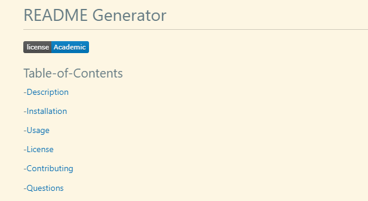
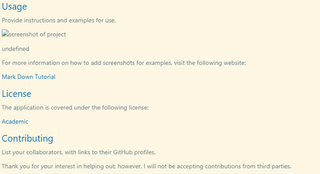

# README_generator

## Table of Content

-[Description](#descripton)

-[Usage](#usage)

-[Photos of Mockup](#photos-of-markup)

-[Links to Demo]

## Description

The goal of this project is to create professional README generator. The generator allow the user to anwser a series of questions regarding their project, based off the response README.md is created.

The README generator is created to help user that overlook the README.md or haven't master concept of what a Professional README has to have.

## Usage

After installation is completed, run the following code: "node index.js" in the terminal. Answer the prompts and after completion, you should see a console log showing your ansers to your prompts, a message that says, "Sucessfull created README.md!"

## Photos of Markup

## Link to Demo

"https://drive.google.com/file/d/1gOCEKN64y56r07eL5cW2wW71UFQ6Cbux/view"

 
